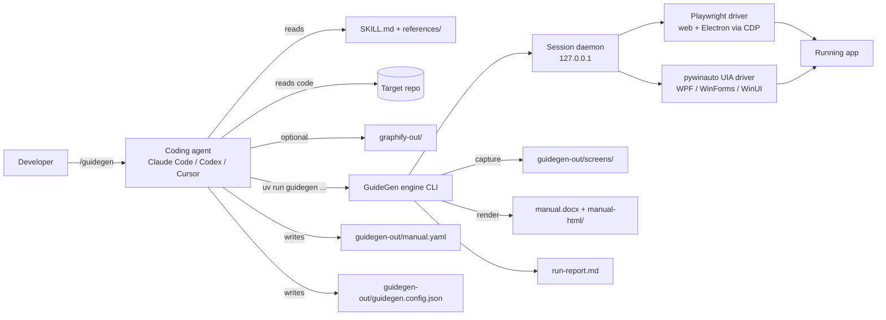

# GuideGen - Technical Architecture

## Overview
GuideGen has two halves, mirroring brag (skill owns the story, Hyperframes renders):

- **The skill** (`skills/guidegen/SKILL.md` + `references/`) is instructions for the coding agent. The agent does all *understanding*: detecting the project, reading code for the surface inventory, choosing tasks, exploring the app, and writing manual text.
- **The engine** (`skills/guidegen/engine/`, a Python package run with `uv`) does all *mechanics*: starting/stopping the app, driving the UI through a session daemon, replaying captures deterministically, redacting, annotating, and rendering Word/HTML.

All state lives in files in the developer's repo. There is no server, database, or network service.



### Run pipeline (what SKILL.md orchestrates)
| Phase | Owner | Input | Output |
|---|---|---|---|
| 0. Brief | agent + `guidegen brief extract` | developer's old manual, outline or standard (asked once) | `guidegen-out/brief.md` |
| 1. Doctor | engine | - | environment check (Python, uv, Playwright browsers, Windows for desktop) |
| 2. Detect | agent + `guidegen detect` | repo | `guidegen-out/.work/detect.json` |
| 3. Start app | engine `app start` | config | running app; hard-blocker stop if it fails |
| 4. Inventory | agent (+ graphify if present) | code | `screens` in manual.yaml |
| 5. Explore | agent via session daemon | running app | confirmed navigation `steps` per screen; unreachable screens flagged |
| 6. Plan tasks | agent | code + evidence | `tasks` in manual.yaml (8-15, ranked) |
| 7. Capture | engine `capture` (deterministic replay) | manual.yaml | screenshots + `capture-log.json` |
| 8. Write | agent | screenshots + code | text fields in manual.yaml |
| 9. Brand | agent + `guidegen brand detect` | repo | `brand` block in config |
| 10. Render | engine `render` | manual.yaml + screens + brand | .docx + HTML |
| 11. Report | engine `report` | logs | `guidegen-out/run-report.md` |

Exploration (phase 5) is agent-driven and adaptive; capture (phase 7) is a scripted replay of recorded steps. Separating them makes captures reproducible and makes `--update` possible without re-exploring.

## Tech Stack
| Layer | Choice | Rationale |
|---|---|---|
| Skill format | Agent Skills `SKILL.md` + markdown references | Works in Claude Code, Codex, opencode, Cursor; same as brag |
| Engine language | Python 3.11+ | Agent-fluent, Playwright first-class, python-docx; same runtime as graphify |
| Packaging/run | `uv` (`uv run --project <skill>/engine guidegen ...`) | One-command isolated install, avoids Windows venv/PATH problems |
| Web + Electron driver | `playwright` (Python) | Official, reliable waits and screenshots; Electron attached via `connect_over_cdp` |
| Windows desktop driver | `pywinauto` (`backend="uia"`) | Microsoft UI Automation, same API FlaUI wraps; behind a `Driver` interface so a FlaUI helper can replace it |
| Image processing | `Pillow` | Crop, highlight, step badges, blur redaction |
| Schema/validation | `pydantic` v2 + `ruamel.yaml` (round-trip, preserves comments) | Validates manual.yaml; preserves developer edits and comments |
| Brief extraction | `python-docx`, `pypdf` | Reads an old manual or outline (.docx, .pdf) for phase 0 |
| Word output | `python-docx` | Headings, images, captions, header/footer, TOC field |
| HTML output | `jinja2` | Template-driven static site |
| SVG logo to PNG | Playwright headless Chromium screenshot | No Cairo dependency on Windows |
| CLI | `typer` | Simple subcommands, JSON output mode for the agent |
| Tests | `pytest` + example apps in `examples/` | Benchmark suite like brag's examples |

## Output Folder Layout
Everything GuideGen creates lives in one folder in the target project root. Default name `guidegen-out/` (lowercase, like `graphify-out/`); override with `--out <path>` (must resolve inside the repo root).

```
my-project/
└── guidegen-out/
    ├── guidegen.config.json   # committed - how to run the app, auth env names, brand, safety, budget
    ├── manual.yaml            # committed - manual content + developer edits (source of truth)
    ├── .gitignore             # committed - written by GuideGen: ignore all except the 3 committed files
    ├── manual.docx            # generated
    ├── manual-html/           # generated - index.html + images/
    ├── screens/               # generated - annotated, redacted PNGs
    ├── capture-log.json       # generated
    ├── run-report.md          # generated
    └── .work/                 # generated - detect.json, session.json, resume state
```

Contents of the folder-local `guidegen-out/.gitignore`:
```
*
!.gitignore
!guidegen.config.json
!manual.yaml
```
GuideGen never edits the project's root `.gitignore` or any file outside this folder. All paths inside config and manual.yaml (e.g. `image: screens/orders-list.png`) are relative to the output folder; code references (`source:`) are relative to the repo root.

## Data Model
All entities are files inside the output folder (see Output Folder Layout).

### `guidegen-out/guidegen.config.json` (created on first run, committed by developer)
```json
{
  "$schema": "https://raw.githubusercontent.com/<org>/guidegen/main/schema/config.schema.json",
  "app": {
    "kind": "web | electron | wpf | winforms | winui",
    "build": "dotnet build src/App/App.csproj -c Debug",
    "start": "dotnet run --project src/App",
    "workingDir": ".",
    "url": "http://localhost:5173",
    "executable": "src/App/bin/Debug/net8.0-windows/App.exe",
    "readyWhen": { "url": "http://localhost:5173", "timeoutSec": 120 },
    "window": { "width": 1280, "height": 800 },
    "viewport": { "width": 1440, "height": 900 }
  },
  "auth": {
    "required": true,
    "usernameEnv": "GUIDEGEN_USER",
    "passwordEnv": "GUIDEGEN_PASSWORD",
    "loginSteps": [ { "action": "type", "target": { "by": "label", "value": "Email" }, "value": "${GUIDEGEN_USER}" } ]
  },
  "seed": { "command": "dotnet ef database update && dotnet run --project tools/Seed", "enabled": true },
  "safety": {
    "allowRemoteBackends": false,
    "allowDestructive": [],
    "redactPatterns": ["[A-Za-z0-9._%+-]+@[A-Za-z0-9.-]+\\.[A-Za-z]{2,}"],
    "redactSelectors": []
  },
  "budget": { "maxScreens": 60, "maxTasks": 15 },
  "brand": {
    "productName": "Acme Quote",
    "companyName": "Acme Ltd",
    "logo": "assets/logo.svg",
    "primaryColor": "#1F4E79",
    "accentColor": "#F29F05",
    "version": "2.3.0"
  },
  "graphify": { "use": "auto" }
}
```
Secrets are never stored: only env var names. `${VAR}` placeholders are resolved by the engine at runtime.

### `guidegen-out/manual.yaml` (source of truth; developer edits this, committed)
```yaml
version: 1
meta:
  title: "Acme Quote User Manual"
  audience: "end users"
  generatedAt: 2026-09-24T10:00:00Z
chapters:            # order of the manual
  - id: getting-started
  - id: tasks
  - id: reference
  - id: troubleshooting
screens:
  - id: orders-list
    title: "Orders"
    kind: page | window | dialog | tab
    source: [ "src/Views/OrdersView.xaml", "src/ViewModels/OrdersViewModel.cs" ]
    sourceHash: "sha256:..."          # used by --update
    status: captured | unreachable | excluded | budget-cut
    unreachableReason: null
    exclude: false                    # developer can set true
    navigate:                         # recorded during exploration
      - { action: click, target: { by: name, value: "Orders" } }
    elements:                         # fields/buttons documented in reference
      - { name: "New Order", type: button, description: "Opens the New Order dialog." }
    text:
      summary: "Lists all orders..."
      override: null                  # developer replacement text wins if set
    image: "screens/orders-list.png"
tasks:
  - id: create-quote
    title: "Create and send a quote"
    rank: 1
    evidence:
      - { type: e2e-test, ref: "tests/e2e/quote.spec.ts" }
      - { type: form-dependency, ref: "Quote requires Customer" }
    exclude: false
    steps:
      - id: s1
        screen: customers-list
        action: { action: click, target: { by: role, value: "button", name: "New Customer" } }
        text: "Click **New Customer**."
        image: "screens/create-quote/s1.png"
        highlight: true
    override: null
troubleshooting:
  - { message: "Quantity must be greater than 0", source: "src/Validators/OrderValidator.cs", text: "..." }
```

### Generated files in `guidegen-out/` (safe to delete, git-ignored by the folder's own `.gitignore`)
- `screens/` - PNGs (raw + annotated)
- `capture-log.json` - per step: status, duration, errors, redactions applied
- `manual.docx`
- `manual-html/index.html` + `manual-html/images/`
- `run-report.md`
- `.work/` - detect.json, session state, temp files

### Action schema (shared by exploration, navigate, and task steps)
| Field | Values |
|---|---|
| `action` | `goto`, `click`, `double_click`, `type`, `select`, `press`, `hover`, `wait`, `screenshot`, `close` |
| `target.by` | web: `role`, `label`, `text`, `testid`, `css`; desktop: `automation_id`, `name`, `control_type`, `path` |
| `value` | text to type/select, key to press, URL for goto |
| `redact` | extra selectors to blur for this step |

Target preference order (most stable first): `testid`/`automation_id` > `role`+name/`label` > `text` > `css`/`path`.

## API Design (engine CLI)
All commands support `--json` for machine-readable output to the agent and `--out <path>` to use an output folder other than `guidegen-out/`. Exit codes: `0` ok, `2` hard blocker (message explains what the agent must ask), `1` other error.

| Command | Purpose |
|---|---|
| `guidegen doctor` | Check Python, uv, Playwright browsers, OS (desktop requires Windows), DPI scale |
| `guidegen detect <repo>` | Heuristic detection of app kind, build/start commands, URL/exe; agent confirms/edits |
| `guidegen app start` / `app stop` | Build, start, wait for ready, optional seed; enforces localhost guard |
| `guidegen session start` / `session stop` | Start the driver daemon bound to 127.0.0.1 with a random token |
| `guidegen act '<action-json>'` | Perform one action in the live session; destructive-action guard applies |
| `guidegen tree [--depth N]` | Accessibility tree (desktop) or DOM/aria snapshot (web) of current view, trimmed for tokens |
| `guidegen shot [--file path]` | Screenshot current view for agent inspection (redaction applied) |
| `guidegen login` | Run `auth.loginSteps` |
| `guidegen capture [--only screen-id...]` | Replay navigate/steps from manual.yaml, write screenshots + capture-log |
| `guidegen brand detect <repo>` | Find logo, colors, names; writes suggestion to stdout |
| `guidegen validate` | Validate manual.yaml and config against schema |
| `guidegen changed` | List screens/tasks whose `sourceHash` no longer matches (for `--update`) |
| `guidegen render [--format docx,html]` | Build outputs from manual.yaml + screens + brand |
| `guidegen report` | Write run-report.md |

## Third-Party Integrations
- **Playwright** (browsers downloaded by `playwright install chromium` during doctor).
- **pywinauto / Microsoft UI Automation** (Windows only).
- **graphify** (optional): if `graphify-out/graph.json` or `GRAPH_REPORT.md` exists, the agent reads communities to group screens into chapters and to find task candidates. GuideGen never installs or runs graphify itself.
- **Coding agent's model**: all language work happens in the developer's agent; the engine makes no LLM calls and has no API keys.

## Deployment & Infrastructure
Distributed as a GitHub repo (MIT), same layout as brag:
```
guidegen/
  skills/guidegen/
    SKILL.md
    references/            # framework recipes, writing style, schema docs
    engine/                # pyproject.toml, src/guidegen_engine/
    templates/             # html/*.j2, docx style settings
    schema/                # config.schema.json, manual.schema.json
  .claude/skills/guidegen  -> ../../skills/guidegen   (symlink)
  .agents/skills/guidegen  -> ../../skills/guidegen   (symlink; Codex, Antigravity)
  .opencode/skills/guidegen-> ../../skills/guidegen   (symlink)
  .claude-plugin/          # plugin.json + marketplace.json
  examples/                # nextjs-shop, wpf-inventory, winforms-crm
  docs/                    # launch site (GitHub Pages)
  README.md  PRODUCT.md  LICENSE
```
Install paths:
- Claude Code: `/plugin marketplace add <org>/guidegen` then `/plugin install guidegen@guidegen`.
- Any agent: `npx skills add https://github.com/<org>/guidegen --skill guidegen`.
- Manual: copy `skills/guidegen/` into the agent's skills folder.

Environments: developer's local machine only. CI in the GuideGen repo runs engine unit tests on Windows + Ubuntu and the web example end-to-end.

## Scalability & Constraints
- Desktop capture requires running on Windows; web capture runs on Windows, macOS, Linux.
- Screenshots are normalized: web viewport 1440x900; desktop window resized to 1280x800; images scaled to 100% DPI equivalent before annotation. GuideGen never changes system DPI or display settings.
- Controls without UI Automation support are captured as whole-window screenshots and documented from code only; noted in the report.
- Default budgets: 60 screens, 15 tasks. No parallel capture in v1 (one app instance).
- Word TOC is inserted as a field; Word asks to update fields on first open (documented).
- `ruamel.yaml` round-trip is required so developer comments/edits in manual.yaml survive regeneration.
