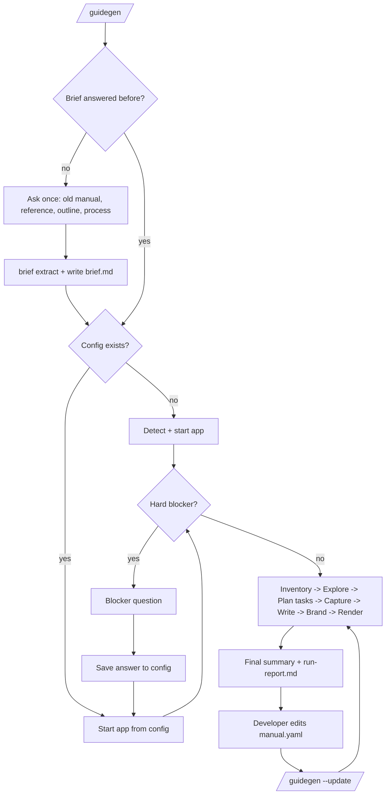

# GuideGen - Frontend Specification

GuideGen has no app UI of its own. Its "frontend" is two things:
1. **Developer experience** inside the coding agent (commands, progress, blocker questions, run report).
2. **The generated manual** end users read (HTML site and Word document).

## Screens / Pages

### A. Developer experience (in the agent chat/terminal)
| Surface | Purpose | Key elements | Primary actions |
|---|---|---|---|
| Invocation | Start a run | `/guidegen`, `/guidegen --update`, `--brief <file|url>`, `--no-brief`, `--ask-brief`, `/guidegen --only <screen-id>`, `--max-screens N`, `--max-tasks N`, `--format docx,html`, `--out <path>` (default `guidegen-out/`) | Run |
| Progress messages | Show phase progress without flooding | One line per phase: `[3/11] Starting app... ready at http://localhost:5173 (42s)`; per-screen lines during capture: `captured 12/41 orders-list` | None (read-only) |
| Brief question (phase 0) | Take the developer's material first | Asked once per repo, before any code is read: old manual, reference manual, outline, or process/standard; file paths, URLs or pasted text; "none" skips. Saved to `brief` in the config and `guidegen-out/brief.md`. Never asked with `--update` | Developer answers or says "none", run continues |
| Blocker question | Ask the one thing needed | Format: what failed, what GuideGen tried, the exact question, where the answer will be saved. E.g. "Login failed: no credentials. Set `GUIDEGEN_USER` and `GUIDEGEN_PASSWORD` in your shell for a test account, then say 'continue'. I'll reference them in guidegen-out/guidegen.config.json." | Developer answers, run resumes |
| Final summary | Deliver outputs | Paths (inside `guidegen-out/`) to `manual.docx`, `manual-html/index.html`, `run-report.md`; counts: screens captured/unreachable/excluded/budget-cut, tasks, redactions; top 3 issues | Open files |
| `run-report.md` | Full accounting | Sections: Summary, Captured, Unreachable (reason + source file), Budget-cut, Tasks, Your brief (sources, tasks from it, items not found in the app), Refused destructive actions, Redactions, Limitations (non-UIA controls), How to fix (edit manual.yaml fields) | Edit manual.yaml, re-run |

### B. Generated HTML manual (`manual-html/index.html`)
| Page/section | Purpose | Key elements |
|---|---|---|
| Home / cover | Identify product | Logo, product name, version, generated date, chapter cards |
| Getting Started | First use | Install/launch, first login, main window tour (annotated overview screenshot) |
| How-To Tasks | Task list + detail | Task list with titles; task page: goal sentence, numbered steps, each with text + annotated screenshot, "Screens used" links |
| Screen Reference | Look up any screen | One section per screen: screenshot, summary, element table (name, type, description), "Used in tasks" links |
| Troubleshooting | Resolve errors | Error message (exact string) -> cause -> fix |
| Search | Find anything | Client-side search over headings and text (no server) |

### C. Generated Word manual (`manual.docx`)
Order: Cover page (logo, product, version, date) -> Table of contents (field) -> Getting Started -> How-To Tasks (Heading 2 per task, numbered steps, image + caption per step) -> Screen Reference (Heading 2 per screen, image, element table) -> Troubleshooting (table). Header: small logo + product name. Footer: page X of Y + version.

## Navigation Flow

HTML manual: left sidebar (chapters -> items), content pane, top search box. Every task step links to its screen reference entry; every screen reference entry lists the tasks that use it.

## Component Breakdown
HTML templates (`templates/html/`):
- `layout.html.j2` - page shell, sidebar, search box, CSS variables from brand.
- `sidebar.html.j2` - chapter/task/screen tree.
- `task.html.j2` - task heading, goal, ordered `step` list.
- `step.html.j2` - step number badge, text, annotated screenshot.
- `screen.html.j2` - screenshot, summary, element table, used-in-tasks links.
- `figure.html.j2` - image with caption and click-to-zoom.
- `troubleshooting.html.j2` - message/cause/fix table.
- `search.js` - inline index built at render time.

Word renderer modules (`engine/render/docx/`): `cover`, `toc`, `headings` (brand-colored styles), `figure` (image 6in wide + caption), `table`, `header_footer`.

Screenshot annotations (engine `annotate`): red/brand-accent rectangle around the acted-on element, numbered circle badge for step number, blur boxes for redaction.

## State Management
- **Source of truth:** `guidegen-out/manual.yaml` (content, structure, overrides) and `guidegen-out/guidegen.config.json` (how to run, brand, safety, budget).
- **Run state:** `guidegen-out/.work/` (detect.json, session.json, partial capture progress) so an interrupted run can resume with `/guidegen --update`.
- **Rendering is pure:** outputs are a function of manual.yaml + screens + brand. Text precedence: `override` > generated `text`.
- HTML manual state is static; search index is embedded JSON; no storage.

## Design Notes
- Plain-language writing for non-technical readers: second person, imperative ("Click **Save**."), UI labels in bold exactly as shown on screen, one action per step, no code or internal names. Rules live in `references/writing-style.md`.
- Visual: clean documentation style (reference points: Stripe docs, Microsoft Learn). Brand primary color for headings and links, accent color for annotations. System font stack (`Segoe UI`, `-apple-system`, `Roboto`, sans-serif); Word uses Calibri/Segoe UI.
- If the brand color contrast against white is below 4.5:1, the renderer darkens it for text use and notes it in the report.

## Responsiveness & Accessibility
- HTML: responsive; sidebar collapses under 900px; images `max-width: 100%`; tables scroll horizontally in their own container.
- Every screenshot has alt text (screen title + step text). Headings are hierarchical. Keyboard-navigable sidebar and search. Light/dark via `prefers-color-scheme` (screenshots unchanged).
- Word: built-in heading styles (so navigation pane and TOC work), alt text on images, captions.
